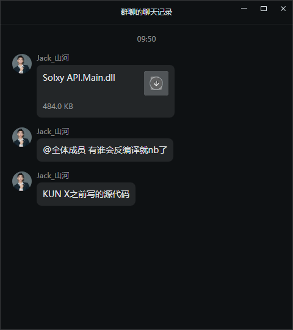
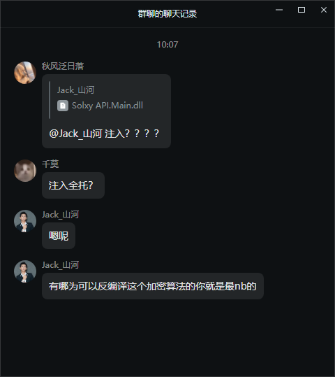
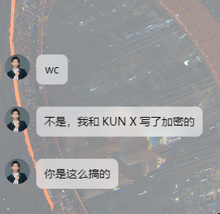
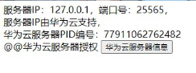
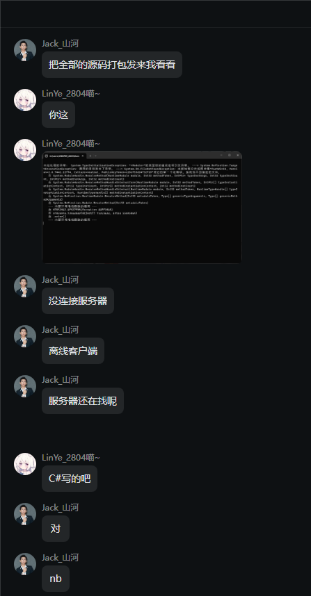

# Solxy
Solxy一个空壳全脱 使用高级的Print和time.sleep进行编写
这个dll也不是他们写的 客户端和配套的dll 只有dll是有东西 客户端完全空壳
# SolxyBETA.src 
6/6 SRC 美其名曰 服务器问题 并且使用了127.0.0.1的服务器ip 也是大神了 并且使用 if card_key != 'c37g24g7_k77-rp47--c57t-p24':
print(Fore.RED + '卡密无效')
sys.exit() 大神卡密验证 
 本卡密仅需1.99r即可永久使用！由于服务器成本，算法的成本所以使用加密卡密，望谅解 from SolxyWebServer.py 
# Solxy API.dll_SRC 
只有dll拥有东西 dll反编译出来的IL代码
# SolxyFixPro.src 
以前版本SRC
# SolxyFix公益全脱工具箱V2.src
以前版本SRC
# 经典图片

这些图片也是典中典 这个127.0.0.1是最抽象的